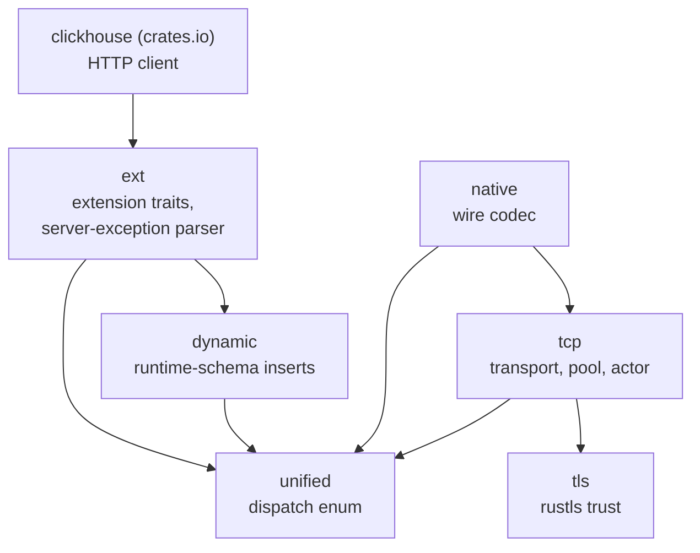

# Architecture: why the crate is shaped this way

The cross-layer map. Per-layer reasoning lives in code comments at the point of
use, and the four sibling pages cover coverage, insert formats, type support and
the unified client -- this page is the argument for the whole and the invariants
that span more than one module.

## The problem

Three gaps in the official client, each of them real in a deployment rather than
theoretical.

1. It speaks HTTP and nothing else. Plenty of ClickHouse deployments expose port
   9000 and no HTTP interface at all, so those are unreachable.
2. `JSON`, `Variant` and `Dynamic` columns do not read. Upstream's Native reader
   refuses the declared type outright.
3. Inserting needs a struct known at compile time. A loader taking arbitrary
   shapes off a topic does not have one.

None of the three can be fixed inside upstream without changing published API,
and fixing them in a fork means carrying a merge against an actively developed
client forever.

## Why a separate crate, not a fork

The crate depends on the published `clickhouse` release and adds layers beside
it. Nothing is patched, nothing is vendored, and there is no `git =`, `path =` or
`[patch.crates-io]` anywhere.

That choice is what keeps the code able to travel back. Same edition, same MSRV,
same `rustfmt.toml`, same lint set, so `ClickHouse/clickhouse-rs` can cherry-pick
a file from here without a reformat or a relicence. It is also why design
rationale sits in comments at the point of use rather than in this directory -- a
cherry-picked file carries its reasoning with it, and a separate design document
would not go along.

## The layers

Every layer is a Cargo feature. `ext` adds no dependency beyond upstream's, and
the native transport is a deliberate opt-in rather than something every consumer
pays for.

| Feature | Module | Owns |
|---|---|---|
| `ext` (default) | `src/ext.rs` | `ping`, `kill_query`, `with_query_id`, `with_session_id`, `with_role`, and `ServerException::parse` for a typed error carrying the server's own code |
| `lz4` (default) | -- | forwards upstream's block compression for HTTP. TCP negotiates `None` |
| `tcp` | `src/tcp/`, `src/worker.rs` | connect, handshake, connection actor, pool, retry, protocol, query, reader, writer |
| `tls` | `src/tls.rs` | rustls trust for the TCP transport |
| `dynamic` | `src/dynamic/` | the `system.columns` schema cache, the per-type encoder, `DynamicInsert` |
| `unified` | `src/unified.rs` | `UnifiedClient`, `Columns`, `Transport` |
| -- | `src/native/` | the Native wire codec, compiled unconditionally |

Adding to the default set later is non-breaking. Removing from it is not.

## One codec, both transports

`src/native/` is the middle of everything, and it is the reason the crate hangs
together rather than being two clients in one package.

A read over TCP decodes Native blocks, which is the only format the native
protocol offers. A read over HTTP asks the server for the TCP wire shape by
sending `client_protocol_version`, then decodes the answer with THIS crate's
codec rather than upstream's reader. So a `JSON` column reads identically over
either transport, and `Variant` and `Dynamic` take the same route -- one document
of text per row.

Inserts are binary on both sides for the same reason: RowBinary over HTTP, Native
columnar over TCP, sharing the encoder. There is no JSONEachRow path anywhere,
and over native TCP the choice does not exist at all, because the protocol
accepts Native and nothing else.

Encoding client-side is also the only place some conversions can happen. Epoch
milliseconds against a `DateTime64` of a declared precision, a string into an
`Enum8` label, an integer width checked rather than silently truncated -- by the
time a server sees JSON text, the type information that would resolve those is
gone.

`src/native/` and `src/tcp/pool.rs` are marked HOT PATH in their own docs and
held to a higher coverage target than the rest, because every row in or out goes
through the first and every operation acquires from the second.

## A dispatch enum, not a trait

`UnifiedClient` is a thin enum over `clickhouse::Client` and `TcpClient`. Both
backends stay untouched, and three client types coexist on purpose: the upstream
client for HTTP-only work such as `JSONEachRow`, `TcpClient` for direct native
access, and `UnifiedClient` as the entry point that dispatches at runtime.

It exposes the common subset and nothing else. HTTP-only methods stay reachable
through `as_http() -> Option<&clickhouse::Client>`, so a caller asks for the HTTP
arm by name and gets a clear `None` on native instead of a confusing runtime
error. A new transport is a variant plus a dispatch arm in each method, and
nothing in the codec knows which transport carried its bytes.

## The three test tiers

They prove different things, and only two of them ever run unattended.

| Tier | Needs | In CI | Proves |
|---|---|---|---|
| unit tests, `tests/smoke.rs`, `tests/tcp_public_surface.rs` | nothing -- they construct and configure offline | yes | branches, the public surface, and that the public types are `Send` and `Sync` |
| `tests/wire_docker.rs` | a container runtime, one pinned server per test | yes -- it fails under `$CI` without one and skips with a message elsewhere | the type matrix against a real server, which builds every value, so a failure is this crate's decoder |
| `tests/json_tcp_live.rs`, `tests/tcp_params_live.rs`, `tests/unified_live.rs` | a real cluster, configured through `CLICKHOUSE_DFE_ENV_FILE` | no -- all eleven are `#[ignore]` | cluster behaviour: `ON CLUSTER` DDL, Distributed reads, replica sync, transport parity |

The tiers are not interchangeable. Coverage counts lines executed, not wire
formats proved: the sparse kind-stack bug sat in code the unit tests ran happily,
because the fixtures and the decoder were written from the same wrong reading of
the spec. Only a real server writing the bytes found it.

## Invariants

1. **The wire format moves between server versions**, so the Docker image tag is
   pinned and never `latest`.
2. **Raising the advertised protocol revision is never a one-line change.** Each
   revision gate adds fields that must be consumed -- in the handshake, and in
   the Progress and ProfileInfo packets -- or the connection stalls against a
   real server.
3. **No `unsafe`.** `unsafe_code = "deny"`, and `unwrap_used` and `expect_used`
   are deny for the crate. The test files allow them at file scope because
   helpers sit outside `#[test]`, where clippy's in-test exemption does not
   reach.
4. **Nothing trusts a length off the wire.** Wire-declared allocations are
   bounded in both the codec and the transport.
5. **Every layer is optional**, so a change that only compiles with the default
   set is a broken change. `make check-features` checks both ends of the matrix.
6. **A coverage number going up is not evidence that a format is right.** A
   hot-path change wants the unit test for the branch AND a matrix row in the
   Docker suite if it touches the wire.
